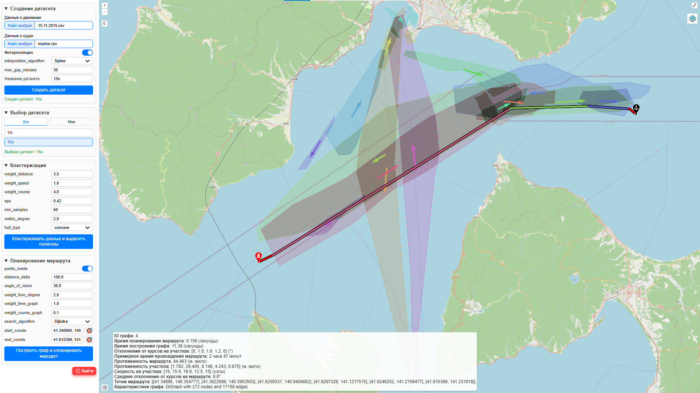

# Разработка веб-сервиса для хранения и обработки траекторных данных о движении судов (Магистерская ВКР)
<b>Авторы:</b>
* Дудко Денис Олегович - Подсистема обработки, кластеризации и модификации ретроспективных данных
* Сазонтова Мария Дмитриевна - Подсистема планирования и визуализации оптимального маршрута на акватории

Система предназначена для обработки данных АИС (Автоматической Идентификационной Системы) с целью оптимизации навигации в условиях растущей интенсивности морского трафика.

Для удобства тестирования система поставляется с предзаполненной БД SQLite, примеры входных данных можно найти в папке DataSamples.

### Инструкция по развертыванию проекта на Linux Mint 20.3 с установленным Python 3.10.5:
1. Скачайте zip-архив с файлами проекта на локальный диск
2. Распакуйте проект и откройте терминал в полученной директории
3. Введите следующие команды:
   1. <code>sudo apt update && sudo apt upgrade</code> - синхронизация и обновление пакетов
   2. <code>sudo apt install python3-pip</code> - установка менеджера пакетов pip
   3. <code>sudo apt install python3.10-dev</code> - установка dev пакета, требуется для pycairo
   4. <code>pip install -r requirements.txt</code> - установка библиотек
   5. <code>flask run</code> - запуск веб-приложения Flask 
   6. Приложение доступно локально по адресу http://127.0.0.1:5000
   7. API для беспилотников доступен через POST запрос на URL: http://127.0.0.1:5000/api/find_drone_path  
   Body - JSON: {"start_point": [41.112852, 140.715037], "end_point": [41.611078, 141.231892]}
4. Введите следующие команды, если при установке библиотек что-то пошло не так:
   1. <code>sudo apt install build-essential libcairo2-dev pkg-config python3-dev</code> - необязательная команда, должна помочь, если pycairo так и не сможет установиться
   2. <code>[ -d "$HOME/.local/bin" ] && PATH="$HOME/.local/bin:$PATH"</code> - добавление пути до установленных библиотек в переменную PATH
   3. <code>echo "export PATH="$PATH >> ~/.bashrc && source ~/.bashrc</code> - сохранение переменной PATH

### Создание requirements.txt:
В случае изменения списка импортируемых модулей, откройте терминал в директории проекта и введите команды: 
1. <code>pip install pipreqs</code> - установка инструмента командной строки для автоматической генерации списка зависимостей Python на основе импортируемых модулей в проекте
2. <code>pipreqs --force --encoding=utf-8</code> - создание файла requirements.txt

### Скриншот интерфейса
